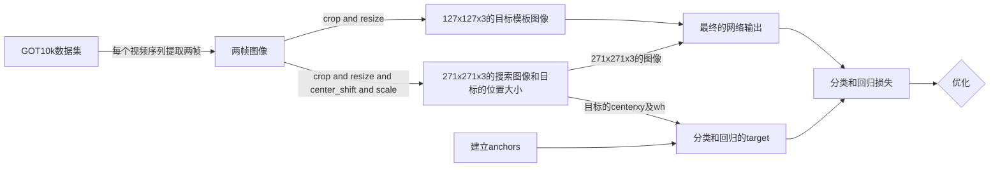

# 1、SiamRPN相比于SiamFC的创新
&emsp;&emsp;SiamFC的一个最明显的缺陷在于，当目标发生较大形变时无法跟踪，原因在于它使用的固定多尺度tracking方式，在前一帧的目标位置生成固定的几个尺度框，选择得分最高的框作为当前帧的跟踪结果。这种tracking策略当目标发生大形变时将无法跟踪，然而SiamRPN很好地解决了该问题，它第一次在目标跟踪领域引入了**anchor**的使用，有了anchor，就不再需要多尺度策略，**有人会问：anchor也是多种尺度啊？关键在于数据关联方式**，SiamFC是利用全卷积结构把目标模板当作卷积核在搜索图像上卷积，有点类似滑动窗口，而SiamRPN是以一种穷举的方式，在搜索图像上举出所有可能存在目标的anchor，简而言之，就是SiamFC相邻帧的尺度变化是较小的，所以无法跟踪大形变物体，而由于穷举anchor的缘故，SiamRPN相邻帧的尺度变化较大，可以由长条变为横条。anchor可以理解为在搜索图像上生成大大小小的各种框，足以覆盖图像内的每个物体(包含待跟踪目标)，示意图如下所示，左侧是经过数据预处理的原始图片，中间图片列出了所有anchor的尺度，最右侧图片是在图片规定好的正方形范围以每个像素为中心生成所有尺度的anchor。
&emsp;&emsp;对比两篇论文的实验结果，发现SiamRPN的fps大于SiamFC，虽然设备不一样，但也不会差别这么大(86fps<160fps)，我在相同环境下实验时，发现SiamRPN只比SiamFC快些许。单看网络结构，会发现SiamRPN的更复杂，而且SiamFC网络有的SiamRPN也都有，速度的差异是看测试过程，SiamFC需要多尺度测试，意味着要进行多次全卷积，而SiamRPN只要一次，这是两者跟踪速度差距的主要因素。
# 2、architecture
&emsp;&emsp;下面是从论文截取的SiamRPN框架图
左边是用于特征提取的孪生子网络。区域建议子网络位于中间，有两个分支，上分支用于分类，下分支用于回归。采用互相关的方法得到两个分支的输出。这两个输出特性映射的详细信息在右边。在分类分支中，输出特征图有2k个通道，对应k个anchor的前景和背景。回归分支中，输出特征图有4k通道，对应4个坐标，用于对anchor位置的微调。回归的作用是得到预测的目标框，回归的任务是将得到的目标框微调，使得位置更加精确。
## 2.1 特征提取网络(Siamese Network)和RPN
&emsp;&emsp;代码如下，这部分代码是SiamRPNNet的网络结构定义__init__和网络参数初始化_init_weights。

```python
class SiamRPNNet(nn.Module):
    def __init__(self, init_weight=False):
        super(SiamRPNNet, self).__init__()
        self.featureExtract = nn.Sequential(
            nn.Conv2d(3, 96, 11, stride=2),  #stride=2  [batch,3,127,127]->[batch,96,59,59]
            nn.BatchNorm2d(96),
            nn.MaxPool2d(3, stride=2),       #stride=2  [batch,96,58,58]->[batch,96,29,29]
            nn.ReLU(inplace=True), 
            nn.Conv2d(96, 256, 5),           #[batch,256,29,29]->[batch,256,25,25]
            nn.BatchNorm2d(256),
            nn.MaxPool2d(3, stride=2),       #stride=2  [batch,256,25,25]->[batch,256,12,12]
            nn.ReLU(inplace=True),
            nn.Conv2d(256, 384, 3),          #[batch,256,12,12]->[batch,384,10,10]
            nn.BatchNorm2d(384),
            nn.ReLU(inplace=True),
            nn.Conv2d(384, 384, 3),          #[batch,384,10,10]->[batch,384,8,8]
            nn.BatchNorm2d(384),
            nn.ReLU(inplace=True),
            nn.Conv2d(384, 256, 3),          #[batch,384,8,8]->[batch,256,6,6]
            nn.BatchNorm2d(256),
        )
        self.anchor_num = config.anchor_num    #每一个位置有5个anchor
        """ 模板的分类和回归"""
        self.examplar_cla = nn.Conv2d(256, 256 * 2 * self.anchor_num, kernel_size=3, stride=1, padding=0)
        self.examplar_reg = nn.Conv2d(256, 256 * 4 * self.anchor_num, kernel_size=3, stride=1, padding=0)
        """ 搜索图像的分类和回归"""
        self.instance_cla = nn.Conv2d(256, 256, kernel_size=3, stride=1, padding=0)
        self.instance_reg = nn.Conv2d(256, 256, kernel_size=3, stride=1, padding=0)
        #这一步是SiamRPN框架中没有的，1x1的卷积，感觉可有可无，仅仅用于回归分支
        #简单理解就是增加了网络的学习能力
        self.regress_adjust = nn.Conv2d(4 * self.anchor_num, 4 * self.anchor_num, 1)
        if init_weight:
            self._init_weights()
    def _init_weights(self):
        for m in self.modules():
            if isinstance(m, nn.Conv2d):
                nn.init.xavier_uniform_(m.weight, 1) #xavier是参数初始化，它的初始化思想是保持输入和输出方差一致，这样就避免了所有输出值都趋向于0
                if m.bias is not None:
                    nn.init.constant_(m.bias, 0)     #偏置初始化为0
            elif isinstance(m, nn.BatchNorm2d):      #在激活函数之前，希望输出值由较好的分布，以便于计算梯度和更新参数，这时用到BatchNorm2d函数
                nn.init.constant_(m.weight, 1)
                nn.init.constant_(m.bias, 0)
            elif isinstance(m, nn.Linear):
                nn.init.xavier_uniform_(m.weight, 1)
                if m.bias is not None:
                    nn.init.constant_(m.bias, 0)
```
self.featureExtract里面定义了特征提取网络，使用的是alexnet，这部分具体讲解课参考[这篇博客](https://blog.csdn.net/qq_41831753/article/details/113783627)，rpn结构定义了4个不同的nn.Conv2d，分别对应architrcture**4个橙黄色的Conv**，主要的推导过程在2.2小节详解。
## 2.2 训练与测试网络推导
### 2.2.1 训练推导
&emsp;&emsp;先给出代码，再看着分析，训练推导代码如下：

```python
"""——————————前向传播用于训练——————————————————"""
    def forward(self, template, detection):
        N = template.size(0)    # batch=32
        template_feature = self.featureExtract(template)    #[32,256,6,6]
        detection_feature = self.featureExtract(detection)  #[32,256,24,24]
        """对应模板分支，求分类核以及回归核"""
        # [32,256*2*5,4,4]->[32,2*5,256,4,4]
        kernel_score = self.examplar_cla(template_feature)
        # 类似可得[32,4*5,256,4,4]
        kernel_regression = self.examplar_reg(template_feature)
        """对应搜素图像的分支，得到搜索图像的特征图"""
        conv_score = self.instance_cla(detection_feature)      #[32,256,22,22]
        conv_regression = self.instance_reg(detection_feature)   #[32,256,22,22]
        """对应模板和搜索图像的分类"""
        # [32,256,22,22]->[1,32*256=8192,22,22]
        conv_scores = conv_score.reshape(1, -1, 22, 22)
        score_filters = kernel_score.reshape(-1, 256, 4, 4)    #[32*2*5,256,4,4]
        #inout=[1,8192,22,22],filter=[320,256,4,4],得到output=[1,32*2*5,19,19]->[32,10,19,19] 32始终是batch不变，勿忘！
        pred_score = F.conv2d(conv_scores, score_filters, groups=N).reshape(N, 10, 19,19)
        """对应模板和搜索图像的回归----------"""
        #[32,256,22,22]->[1,32*256=8192,22,22]
        conv_reg = conv_regression.reshape(1, -1, 22, 22)
        reg_filters = kernel_regression.reshape(-1, 256, 4, 4)   #[32*4*5,256,4,4]
        #input=[1,8192,22,22],filter=[340,256,4,4],得到output=[1,32*4*5,19,19]->[32,4*5=20,19,19]——>微调
        pred_regression = self.regress_adjust(F.conv2d(conv_reg, reg_filters, groups=N).reshape(N, 20, 19, 19))
        #score.shape=[32,10,19,19],regression.shape=[32,20,19,19]
        return pred_score, pred_regression
```
代码注释中，假定训练时的batch_size=32，首先127x127x3大小的目标模板图像和271x271x3大小检测图像(搜索图像)共享特征提取网络的网络参数，得到相应大小的feature map，分别为6x6x256、24x24x256，论文中的检测图像大小是255，所以输出的feature map大小为22x22x256；然后，将6x6x256大小的检测图像通过两个卷积层self.instance_cla和self.instance_reg分别用于回归和分类，可以看到，这两个卷积层的结构是完全相同的，最终大小都为22x22x256，但这两个feature map的用途不一样，分别用于分类和回归，再将上分支通过特征提取网络得到的6x6x256大小的feature map分别通过self.examplar_cla和self.examplar_reg，得到的feature map大小为[32,256x2x5,4,4]和[32,4x5x256,4,4]，其中2和4分别表示需要学习的实际参数，2代表前景和背景，前景分数越大，代表是目标的概率越高，4表示dx、dy、dw、dh四个微调参数。
&emsp;&emsp;接下来就是将得到的4张feature map两两成对互相关，如果有对互相关不理解的小伙伴在[博客](https://blog.csdn.net/qq_41831753/article/details/113783627)中有讲解。最终得到用于分类和回归的feature map大小分别是[32,10,19,19]、[32,20,19,19]就可用于训练。
### 2.2.1 测试推导
&emsp;&emsp;先上代码

```python
"""—————————————初始化————————————————————"""
    def track_init(self, template):
        N = template.size(0) #1
        template_feature = self.featureExtract(template)# [1,256, 6, 6]
        # kernel_score=[1,2*5*256,4,4]   kernel_regression=[1,4*5*256,4,4]
        kernel_score = self.examplar_cla(template_feature)
        kernel_regression = self.examplar_reg(template_feature)
        self.score_filters = kernel_score.reshape(-1, 256, 4, 4)    #[2*5,256,4,4]
        self.reg_filters = kernel_regression.reshape(-1, 256, 4, 4) #[4*5,256,4,4]
    """—————————————————跟踪—————————————————————"""
    def track_update(self, detection):
        N = detection.size(0)
        # [1,256,24,24]
        detection_feature = self.featureExtract(detection)
        """----得到搜索图像的feature map-----"""
        conv_score = self.instance_cla(detection_feature)     #[1,256,22,22]
        conv_regression = self.instance_reg(detection_feature)  #[1,256,22,22]
        """---------与模板互相关"""
        #input=[1,256,22,22] filter=[2*5,256,4,4] gropu=1 得output=[1,2*5,19,19]
        pred_score = F.conv2d(conv_score, self.score_filters, groups=N)
        # input=[1,256,22,22] filter=[4*5,256,4,4] gropu=1 得output=[1,4*5,19,19]
        pred_regression = self.regress_adjust(F.conv2d(conv_regression, self.reg_filters, groups=N))
        #score.shape=[1,10,19,19],regression.shape=[1,20,19,19]
        return pred_score, pred_regression
```
仔细分析，这部分代码与forward类似，只是结构有些变化，训练时是上下分支同时输入输出，而在测试时，明确分为了初始帧和后续待跟踪帧通过的网络结构，后续帧与固定不变的初始帧互相关运算。论文中也提到过，如下，论文说这是SiamRPN快速的原因，但要知道这并不是SiamRPN相比于SiamFC更快的原因。


最后，验证下搭建网络的正确性，验证代码和结果如下，可以看到网络搭建是正确的。

```python
if __name__ == '__main__':
    model = SiamRPNNet()
    z_train = torch.randn([32,3,127,127])  #batch=8
    x_train = torch.randn([32,3,271,271])
    # 返回shape为[32,20,19,19] [32,10,19,19]  20=5*4 10=5*2
    pred_score_train, pred_regression_train = model(z_train,x_train)
    z_test = torch.randn([1,3,127,127])
    x_test = torch.randn([1,3,271,271])
    model.track_init(z_test)
    # 返回shape为[1,20,19,19] [1,10,19,19]
    pred_score_test, pred_regression_test = model.track_update(x_test)
```


**Over**，第一部分architecture代码分析就结束了！！

# 1、数据增强、建立anchor
&emsp;&emsp;SiamRPN关于training的详细流程图如下：

## 1.1 数据增强
&emsp;&emsp;接下来，分析下数据增强和生成anchor的代码，数据增强就是在得到原始搜索图像的时候对目标进行了随机的小移位以及目标长宽的缩放，当然也可以添加其他数据增强方式，比如模糊处理等，代码中仅对搜索图像的目标进行了这些操作。**这里解释下代码中为什么没对目标模板图像数据增强呢**？因为在跟踪过程中，anchor是反映在搜索图像上，所以对搜索图像中的目标shift后，训练过程要找的anchor就不仅仅是整个搜索图像的中心位置了，而是在位移所在处，这样训练后的网络可以避免在测试过程中网络对中心的敏感趋向性。而对目标模板图像进行类似的处理显得就没那么重要了，因为可以把目标模板图像的特征图是卷积核，跟踪过程是在搜索图像寻找与卷积核最相似的部分(分类的前景值最大)，其实相比于shift，scale和图像模糊等对目标模板图像的意义更大，以上只是我个人的理解，其实加不加都行，多多少少有点益处。在阅读pysot源码时，对目标模板图像和搜索图像采取了同样的数据增强方式。

```python
	shift_x = np.random.choice(range(-12,12))
	shift_y = np.random.choice(range(-12,12))
	scale_h = 1.0 + np.random.uniform(-0.15, 0.15)
	scale_w = 1.0 + np.random.uniform(-0.15, 0.15)
```
如代码所示，对目标的中心12个像素内的shift操作，12个像素的位移是相对于271x271大小的图像而言，并对其高宽进行0.85~1.15范围内的的缩放比例。验证下最终得到的搜索图像效果，

```python
	gt = np.array(list(map(round, gt)))
    print(gt) #前两个值是shift_x和shift_y
    gt[0:2] = gt[0:2]+135  #得到真正的center_x和center_y的坐标
    gt = cxcywhtoltwh(gt)
    gt = gt.squeeze(axis=0)
    print(gt)
	plt.imshow(instance_img)
    ax = plt.gca()
    ax.add_patch(plt.Rectangle((gt[0:2]),gt[2],gt[3],color="red", fill=False, linewidth=1))
    plt.show()
```


## 1. 2 建立anchor
&emsp;&emsp;anchor的建立代码如下所示：

```python
#获取所有像素点的anchors
#total_stride=8; base_size=8; scales=[8]; ratios=[0.33, 0.5, 1, 2, 3] ；core_size=19
def generate_anchors(total_stride, base_size, scales, ratios, score_size):
    #获取不同尺度和大小的anchor
    anchor_num = len(ratios) * len(scales)   #5
    anchor = np.zeros((anchor_num, 4), dtype=np.float32) #shepe(5,4)
    size = base_size * base_size  #8*8=64 面积
    count = 0
    for ratio in ratios:
        #w和h是相对于19x19而言
        w = int(np.sqrt(size / ratio))
        h = int(w * ratio)
        for scale in scales:
            #anchor_w、anchor_h是相对于原始图片而言，因为stride=8，所以scale一定要是8得整数倍
            anchor_w = w * scale
            anchor_h = h * scale
            anchor[count, 0] = 0
            anchor[count, 1] = 0
            anchor[count, 2] = anchor_w
            anchor[count, 3] = anchor_h
            count += 1
    #tile复制功能，anchor[5,4]->[5,4*19*19]默认维度是第1维，不是第0维
    #anchor[5,0:4]=anchor[5,4*(i-1):4*i], i=1,2,3,,,19*19
    anchor= np.tile(anchor, score_size * score_size)
    #[1805,4],anchor[0:19*19,4]中每个元素都相同，anchor[19*19:19*19*2，4]中每个元素相同，以此类推
    anchor = anchor.reshape((-1, 4))
    #取19x19的中心区域画anchor
    ori =-(score_size // 2) * total_stride #ori=-72=-9*8
    """取19x19的feature map的anchor，范围为19//2，映射回原图(271*271)就是 19//2 * 8"""
    #xx={ndarray:(19,19)}[[-72 -64 -56 -48 -40 -32 -24 -16  -8   0   8  16  24  32  40  48  56  64,   72], [-72 -64 -56 -48 -40 -32 -24 -16  -8   0   8  16  24  32  40  48  56  64,   72], [-72 -64 -56 -48 -40 -32 -24 -16  -8   0   8  16  24  32  40  48  56  64,   72], [-72 -64 -56 -48 -40 -32 -24 -16  -8   0   8  16  24  32  40  48  56  64,   72], [-72 -64 -56 -48 -40 -32 -24 -16  -8   0   8  16  24  32  40  48  56  64,   72], [-72 -64 -56 -48 -40 -32 -24 -16  -8   0   8  16  24  32  40  48  56  64,   72], [-72 -64 -56 -48 -40 -32 -24 -16  -8   0   8  16  24  32  40  48  56  64,   72], [-72 -64 -56 -48 -40 -32 -24 -16  -8   0   8  16  24  32  40  48  56  64,   72], [-72 -64 -56 -48 -40 -32 -24 -16  -8   0   8  16  24  32  40  48  56  64,   72], [-72 -64 -56 -48 -40 -32 -24 -16  -8   0   8  16  24  32  40  48  56  64,   72], [-72 -64 -56 -48 -40 -32 -24 -16  -8   0   8  16  24  32  40  48  56  64,   72], [-72 -64 -56 -48 -40 -32 -24 -16  -8   0   8  16  24  32  40  48  56  64,   72], [-72 -64 -56 -48 -40 -32 -2...
    #yy={ndarray:(19,19)}[[-72 -72 -72 -72 -72 -72 -72 -72 -72 -72 -72 -72 -72 -72 -72 -72 -72 -72,  -72], [-64 -64 -64 -64 -64 -64 -64 -64 -64 -64 -64 -64 -64 -64 -64 -64 -64 -64,  -64], [-56 -56 -56 -56 -56 -56 -56 -56 -56 -56 -56 -56 -56 -56 -56 -56 -56 -56,  -56], [-48 -48 -48 -48 -48 -48 -48 -48 -48 -48 -48 -48 -48 -48 -48 -48 -48 -48,  -48], [-40 -40 -40 -40 -40 -40 -40 -40 -40 -40 -40 -40 -40 -40 -40 -40 -40 -40,  -40], [-32 -32 -32 -32 -32 -32 -32 -32 -32 -32 -32 -32 -32 -32 -32 -32 -32 -32,  -32], [-24 -24 -24 -24 -24 -24 -24 -24 -24 -24 -24 -24 -24 -24 -24 -24 -24 -24,  -24], [-16 -16 -16 -16 -16 -16 -16 -16 -16 -16 -16 -16 -16 -16 -16 -16 -16 -16,  -16], [ -8  -8  -8  -8  -8  -8  -8  -8  -8  -8  -8  -8  -8  -8  -8  -8  -8  -8,   -8], [  0   0   0   0   0   0   0   0   0   0   0   0   0   0   0   0   0   0,    0], [  8   8   8   8   8   8   8   8   8   8   8   8   8   8   8   8   8   8,    8], [ 16  16  16  16  16  16  16  16  16  16  16  16  16  16  16  16  16  16,   16], [ 24  24  24  24  24  24  2...
    xx, yy = np.meshgrid([ori + total_stride * dx for dx in range(score_size)],
                         [ori + total_stride * dy for dy in range(score_size)])
    xx = np.tile(xx.flatten(), (anchor_num, 1)).flatten()  #(1805,)
    yy = np.tile(yy.flatten(), (anchor_num, 1)).flatten()  #(1805,)
    anchor[:, 0], anchor[:, 1] = xx.astype(np.float32), yy.astype(np.float32)
    #anchor.shape=(1805,4)  4代表[center_x,center_y,w,h]
    return anchor
```
anchor的尺度取[0.5,0.66,1,1.5,2]，尺度完全可以自己调整为其它，里面的具体尺度值代表高宽比，大小须为8的倍数，因为anchor是定义在19x19大小的feature map上的，最后得到的anchor要映射会272x272大小的原始图像，19x19上的8x8的像素面积的对应原图的面积大小是64x64。在穷举anchor的时候，论文提到，并不是对19x19每个像素位置都取5种尺度的anchor，而是在规定特征图范围内取anchor，

在距离中心不超过7个像素点位置取anchor，即14x14的区域内，而代码中在19x19整个区域内穷取anchor，这样各有各的好把，14x14的情况下训练速度、跟踪速度都加快，19x19的话可以跟踪到快速运动的物体。
&emsp;&emsp;具体的anchor生成方法是，先得到基准anchor，基准anchor的shape是[5,4]，代表4中尺度，每种尺度的向量记录anchor的[center_x,center_y,w,h]，这里的基准anchor的center_x和center_y是图像的中心点(0,0)，然后再对其进行位移，再19x19的特征图上是x、y轴都是以1个像素为单位平移，x和y轴的平移坐标是-9.-8.-7......0......7.8.9，乘上步距8映射到原图的的位移就是-72.-64....0.....64.72，所以共得到19x19x5=1805个anchor，下图展示了对比19x19的feature map的anchor和原图的anchor，这里feature map的anchor只简单展示，原图anchor穷举。有一点值得注意的是，原图的效果看上去并不是穷举anchor，在图像周边缘还有很多区域无anchor覆盖，这是由于19x8=152不等于272，网络卷积层no padding所造成的，不过看上去好像又覆盖了大面积，不像是152，至少200+，这是因为原图中anchor的大小是64x64，anchor给的是中心点坐标，中心位置加上一半的高宽就得到下面的效果。


# 2、分类和回归的target
&emsp;&emsp;分类的target是根据每个anchor与目标的grundtruth计算IOU得到，计算二者IOU的代码如下，函数给的参数是1805个anchor以及目标的单个groundtruth，最终返回1805个IOU值。

```python
    def compute_iou(self, anchors, box):
        #将box复制1805份，gt_box.shape=(1805,4) 每个[i,4](i=0...1804)都相同
        gt_box = np.tile(box.reshape(1, -1), (anchors.shape[0], 1))
        anchor_x1 = anchors[:, :1] - anchors[:, 2:3] / 2 + 0.5 #xmin
        anchor_x2 = anchors[:, :1] + anchors[:, 2:3] / 2 - 0.5 #xmax
        anchor_y1 = anchors[:, 1:2] - anchors[:, 3:] / 2 + 0.5 #ymin
        anchor_y2 = anchors[:, 1:2] + anchors[:, 3:] / 2 - 0.5 #ymax
        gt_x1 = gt_box[:, :1] - gt_box[:, 2:3] / 2 + 0.5 #xmin
        gt_x2 = gt_box[:, :1] + gt_box[:, 2:3] / 2 - 0.5 #xmax
        gt_y1 = gt_box[:, 1:2] - gt_box[:, 3:] / 2 + 0.5 #ymin
        gt_y2 = gt_box[:, 1:2] + gt_box[:, 3:] / 2 - 0.5 #ymax
        xx1 = np.max([anchor_x1, gt_x1], axis=0)
        xx2 = np.min([anchor_x2, gt_x2], axis=0)
        yy1 = np.max([anchor_y1, gt_y1], axis=0)
        yy2 = np.min([anchor_y2, gt_y2], axis=0)
        inter_area = np.max([xx2 - xx1, np.zeros(xx1.shape)], axis=0) * np.max([yy2 - yy1, np.zeros(xx1.shape)],axis=0)
        area_anchor = (anchor_x2 - anchor_x1) * (anchor_y2 - anchor_y1)
        area_gt = (gt_x2 - gt_x1) * (gt_y2 - gt_y1)
        iou = inter_area / (area_anchor + area_gt - inter_area + 1e-6)
        #返回iou.shape=(1805,1)
        return iou
```
得到IOU值后，如论文所述，根据所给定的阈值0.6和0.3，大于0.6为正样本，target值为1，小于0.3为负样本，target值为0。代码中，在IOU在0.3到0.6之间的的anchor设它的target为-1，训练时，忽略target为-1的部分，所以分类target的维度是(1805,1)。

```python
		iou = self.compute_iou(anchors, box).flatten()
        pos_index = np.where(iou > config.pos_threshold)[0]  #>0.6的为正样本
        neg_index = np.where(iou < config.neg_threshold)[0]  #<0.3的为负样本
        #正样本为1，负样本为0，抛弃的为-1(iou介于0.3到0.6之间)
        label = np.ones_like(iou) * -1
        label[pos_index] = 1
        label[neg_index] = 0
```
下面用图展示一下，左图红色框是目标的groundtruth，右图红色框是列举的几个anchor。


&emsp;&emsp;然后就是回归的target了，在测试过程中，回归参数的作用是对预测到的目标框进行微调，使它的位置更加准确。计算回归target的代码和具体示意图如下：

```python
#返回regression_target.shape=(1805,4),4:(dx,dy,dw,dh)
    def get_target_reg(self, anchors, gt_box):
        #anchor.shape=[1805,4] ge_box.shape(4,)
        anchor_xctr = anchors[:, :1]
        anchor_yctr = anchors[:, 1:2]
        anchor_w = anchors[:, 2:3]
        anchor_h = anchors[:, 3:]
        gt_cx, gt_cy, gt_w, gt_h = gt_box
        #真实gt以及anchor的回归参数，网络输出得到的是预测pre以及anchor的回归参数
        target_x = (gt_cx - anchor_xctr) / anchor_w  # (1805,1) dx=(gx-Ax)/Aw A:anchor g:groundtruth
        target_y = (gt_cy - anchor_yctr) / anchor_h  # (1805,1) dy
        target_w = np.log(gt_w / anchor_w)  # (1805,1) pw
        target_h = np.log(gt_h / anchor_h)  # (1805,1) ph
        regression_target = np.hstack((target_x, target_y, target_w, target_h)) #(1805,4)
        return regression_target
```


红色的目标的groundtruth，黄色的是预测的目标框，黑色的经过微调之后得到的目标框，回归参数共有4个dx、dy、dw和dh，分别调整黄色预测框的中心位置和高宽。训练时，仅对正样本(分类target值为1)进行回归训练，训练的时候，就是要把网络输出得到的回归参数与给的回归target最小化，再用网络输出的回归参数微调预测框，得到的回归target维度是(1805,4)。

# 3、损失函数
&emsp;&emsp;损失函数分为分类损失和回归损失，分类损失计算方法采用交叉熵损失函数，回归损失计算方法采用smooth_L1损失函数。训练时，采用损失加权的方法，代码中简单的使用1：5的权重。

```python
        """———————将模板和搜索图像输入net，得到回归参数和分类分数————"""
	    #score.shape=[8,10,19,19],regression.shape=[8,20,19,19]
	    pred_score, pred_regression = model(exemplar_imgs.cuda(), instance_imgs.cuda())
	    #pre_conf.shape=(8,1805,2)
	    pred_conf = pred_score.reshape(-1, 2, config.anchor_num * config.score_size * config.score_size).permute(0,2,1)
	    #pred_offset.shape=[8,1805,4]
	    pred_offset = pred_regression.reshape(-1, 4,config.anchor_num * config.score_size * config.score_size).permute(0,2,1)
	    """——————————————计算分类和回归损失————————————————————-"""
	    cls_loss = rpn_cross_entropy_balance(pred_conf, conf_target, config.num_pos, config.num_neg, anchors,
	                                         nms_pos=config.nms_pos, nms_neg=config.nms__neg)
	    reg_loss = rpn_smoothL1(pred_offset, regression_target, conf_target, config.num_pos, nms_reg=config.nms_reg)
	    loss = cls_loss + config.loss_weight * reg_loss    #分类权重和回归权重 1：5
```
将网络的输出与上一节所讲的分类和回归target输入损失函数进行训练，接下来分别讲解rpn_cross_entropy_balance以及rpn_smoothL1损失函数。
## 3.1 分类损失
&emsp;&emsp;进入rpn_cross_entropy_balance函数一探究竟
```python
def rpn_cross_entropy_balance(input, target, num_pos, num_neg, anchors, nms_pos=None, nms_neg=None):
    loss_all = []
    for batch_id in range(target.shape[0]):  #遍历batch，计算损失
        min_pos = min(len(np.where(target[batch_id].cpu() == 1)[0]), num_pos) #num-pos=16，意思target=1的最多取16个
        min_neg = int(min(len(np.where(target[batch_id].cpu() == 1)[0]) * num_neg / num_pos, num_neg)) #target=0最多48个，且保证是target=1个数的三倍
        pos_index = np.where(target[batch_id].cpu() == 1)[0].tolist() #参数列表
        neg_index = np.where(target[batch_id].cpu() == 0)[0].tolist() #参数列表
        if nms_pos: #False
            pass
        else:
            pos_index_random = random.sample(pos_index, min_pos) #随机取min_pos个正样本的索引
            if len(pos_index) > 0:
                # 交叉熵损失
                pos_loss_bid_final = F.cross_entropy(input=input[batch_id][pos_index_random],target=target[batch_id][pos_index_random], reduction='none')
            else:
                pos_loss_bid_final = torch.FloatTensor([0]).cuda()
        if nms_neg:#False
            pass
        else:
            if len(pos_index) > 0:
                neg_index_random = random.sample(neg_index, min_neg)
                #计算损失时，input要是float型，target为long型，reduction为None表示不计算损失平均
                #如果target为1，把input的第二维度当作计算，target为0时，把input的第一位当作计算
                neg_loss_bid_final = F.cross_entropy(input=input[batch_id][neg_index_random],target=target[batch_id][neg_index_random], reduction='none')
            else:
                neg_index_random = random.sample(np.where(target[batch_id].cpu() == 0)[0].tolist(), num_neg)
                neg_loss_bid_final = F.cross_entropy(input=input[batch_id][neg_index_random],target=target[batch_id][neg_index_random], reduction='none')
        #每张图片的损失平均值
        loss_bid = (pos_loss_bid_final.mean() + neg_loss_bid_final.mean()) / 2
        loss_all.append(loss_bid)
    final_loss = torch.stack(loss_all).mean()
    return final_loss
```
&emsp;&emsp;首先，代码没有使用论文提及的nms非极大抑制比，原因是在分类损失中，只有前景和后景两个分数值，这两个分数值不能直观体现anchor的重叠率，倘若两个anchor分数都为0.7，那么anchor的位置可以在groundtruth的上下左右各个位置，所以代码中，随机抽取了16个分类target为1的正样本和48个分类target为0的负样本进行训练。
&emsp;&emsp;`F.cross_entropy`函数是重点，在训练过程中，正样本和负样本单独训练，先分析正样本训练，输入从每个batch中取16个样本，它的索引为分类target为1的索引，target肯定就是16个1喽，那么训练时，使用的是输入的第二维度，白话讲，就是让第input每个anchor分类预测的**第二个值，即前景**的值训练得接近于1；负样本训练类似，只是target值为0，所以要训练使得anchor分类预测的第一个值为0。具体见下图分析，并且还用代码作了验证。这里提前说下，在测试过程中，要得到预测框的方法是选择1805个anchor第2个值最大的anchor作为预测框，再进行微调。

```python
if __name__ == '__main__':
    input = np.array([[0.2,0.8],[0.4,0.6],[0.9,0.1]],dtype=float)
    input = torch.from_numpy(input)
    target = np.array([1,1,0],dtype='int64')
    target = torch.from_numpy(target)
    loss = F.cross_entropy(input,target,reduction='none')
    print(loss)  #输出为tensor([0.4375, 0.5981, 0.3711], dtype=torch.float64)
```


## 3.1 回归损失
&emsp;&emsp;回归损失使用的是smooth_L1函数，该函数的详解查看这篇[文章](https://www.cnblogs.com/wangguchangqing/p/12021638.html)，极力推荐!anchor位置的回归训练仅针对正样本，首先要得到anchor，那么根据分类的target为1得到对应正样本anchor的索引。接下来本该对anchor为1的样本作nms处理，因为这样可以得到不重叠的anchor，但是，代码却没有，为什么？因为之前在计算正样本的时候，IOU要大于0.6，这样基本上正样本anchor都集中在groundtruth附近，如果再剔出重复anchor，那么阈值得设置很大才合适，因为设置小了，基本上就得不到16个正样本了，所以nms操作对回归训练影响很小。代码中选择损失值最大的16个anchor策略进行回归训练来替代nms。

```python
# input(batch,1805,4) target(batch,1805,4) label(16,1805),num_pos=16  ohem=False(不使用nms)
def rpn_smoothL1(input, target, label, num_pos=16, nms_reg=True):
    loss_all = []
    for batch_id in range(target.shape[0]): #遍历每张图片计算回归损失
        min_pos = min(len(np.where(label[batch_id].cpu() == 1)[0]), num_pos) #最多取16个正样本，回归只针对正样本
        if nms_reg:
            pos_index = np.where(label[batch_id].cpu() == 1)[0]
            if len(pos_index) > 0:
                loss_bid = F.smooth_l1_loss(input[batch_id][pos_index], target[batch_id][pos_index], reduction='none')
                #得到损失值得索引，损失小到大排列
                sort_index = torch.argsort(loss_bid.mean(1))
                #从最后取损失值大的用于训练
                loss_bid_nms = loss_bid[sort_index[-num_pos:]]
            else:
                loss_bid_nms = torch.FloatTensor([0]).cuda()[0]
            loss_all.append(loss_bid_nms.mean())
    final_loss = torch.stack(loss_all).mean()
    return final_loss
```
&emsp;&emsp;至此，training分析代码完了，最后是test代码的分析。

# 1、init
&emsp;&emsp;init的主要任务是获得上分支的feature map与后续帧的feature map互相关，在获得127x127x3大小的目标模板图像后，要对其增加一个维度再输入网络，返回的分类卷积核和回归卷积核的shape分别为[10,256,4,4]、[20,256,4,4]，这里名没有直接return返回这两个核，而是将它们存放在self里(SiamRPNTracker类)，可以翻看第一篇architecture的分析；其次，init还要获取当前目标的位置，高宽等，后续update要对其进行更新，也就是预测新的目标位置和目标大小。

```python
#初始帧
    def init(self, frame, bbox):
        #[l,t,w,h]->[center_x,center_y,w,h]
        self.bbox = np.array([bbox[0]-1 + (bbox[2]-1) / 2 , bbox[1]-1 + (bbox[3]-1) / 2 , bbox[2], bbox[3]])
        #获取目标中心点[c_x,c_y]以便后续使用
        self.pos = np.array([bbox[0]-1 + (bbox[2]-1) / 2 , bbox[1]-1 + (bbox[3]-1) / 2])
        #获取目标宽高[w,h]以便后续使用
        self.target_sz = np.array([bbox[2], bbox[3]])
        #获取目标宽高[w,h]以便后续使用
        self.origin_target_sz = np.array([bbox[2], bbox[3]])
        #获取需要图像R/G/B均值   img_mean.shape=(1,1,3)
        self.img_mean = np.mean(frame, axis=(0, 1))
        #获取模板图像
        #返回127x127x3大小的图像
        exemplar_img = get_exemplar_image(frame, self.bbox,config.exemplar_size, config.context_amount, self.img_mean)
        #增加一个batch维度再输入网络
        exemplar_img = self.transforms(exemplar_img)[None, :, :, :]
        self.model.track_init(exemplar_img.cuda())
```

# 2、update(tracking)
&emsp;&emsp;update过程还是follow代码流程来分析

```python
    def update(self, frame):
        #传入上一帧的bbox，以及保持初始帧的img_mean不变来填充后续所有帧
        #返回271x271x3大小的图片、缩放因子是271/(上下文信息x271/127)
        instance_img_np, _, _, scale_x = get_instance_image(frame, self.bbox, config.exemplar_size,config.instance_size, config.context_amount, self.img_mean)
        """————————————————得到分类分数和回归参数————————————"""
        #增加一个batch维度再送入网络
        instance_img = self.transforms(instance_img_np)[None, :, :, :]
        #返回score.shape=[1,10,19,19],regression.shape=[1,20,19,19]
        pred_score, pred_regression = self.model.track_update(instance_img.cuda())
        #[1,10,19,19]->[1,2,5*19*19]->[1,1805,2] conf即置信度
        pred_conf = pred_score.reshape(-1, 2, config.anchor_num * config.score_size * config.score_size).permute(0,2,1)
        #[1,20,19,19]->[1,4,5*19*19]->[1,1805,4] offset即位移，对anchor微调
        pred_offset = pred_regression.reshape(-1, 4,config.anchor_num * config.score_size * config.score_size).permute(0,2,1)
```
先获得271x271x3大小的检测图像，扩维后将其输入网络，得到互相关的输入，再调用track_update方法得到分类分数和回归参数，之后就是这两者shape变换，以便后续使用。

```python
	    #传入的anchor(1805,4) delta(1805,4),delta是回归参数，对anchor进行调整，返回调整后的anchor，即pre_box(1805,4)
        box_pred = box_transform_inv(self.anchors, delta)
        #pred_conf=[1,1805,2]
        #score_pred.shape=torch.Size([1805]) 取1，表示取正样本
        score_pred = F.softmax(pred_conf, dim=2)[0, :, 1].cpu().detach().numpy()#计算预测分类得分
```
将1805组回归参数应用于1805个anchor，使其位置信息更加准确，并对分类分数的前景值进行softmax处理，得到1805个和为1的数，之后找到最大的数，该最大值对应的anchor就是预测框。

```python
		#尺度惩罚 一个>1的数
        s_c = change(sz(box_pred[:, 2], box_pred[:, 3]) / (sz_wh(self.target_sz * scale_x)))
        #比例惩罚 一个>1的数
        r_c = change((self.target_sz[0] / self.target_sz[1]) / (box_pred[:, 2] / box_pred[:, 3]))
        # 尺度惩罚和比例惩罚 penalty_k=0.22,penalty最大为1，即不惩罚
        penalty = np.exp(-(r_c * s_c - 1.) * config.penalty_k)
        pscore = penalty * score_pred#对每一个anchors的正样本分类预测分数×惩罚因子
        pscore = pscore * (1 - config.window_influence) + self.window * config.window_influence #再乘以余弦窗
        max_pscore_id= np.argmax(pscore) #返回最大得分的索引id
```
惩罚的前提是假设目标在相邻帧的大小(尺度以及高宽比例)变化，所以增加了尺度和比例两个惩罚项，又假设目标在相邻帧的位置变化也不会太大，所以使用余弦窗来抑制大位移，正如论文所言，使用$penalty$来抑制尺度和比例的大变化，余弦窗口抑制大位移。在代码$penalty$公式中，倘若anchor的大小和比例与上一帧接近，s_c和r_c这两个值就都为1，$penalty$=e^0=1，即不惩罚。通过$penalty$和余弦窗之后，得到最大的的前景分值索引，记为max_pscore_id。

&emsp;&emsp;得到max_pscore_id后意味着找到了前景分数最大的anchor作为预测框，上面，已经对其进行了微调，所以现在得到的anchor就是最终的预测框了。接下来就是拿取新的预测框的中心位置和大小去更新目标状态，就不分析了。
&emsp;&emsp;还有一点忘了说，nms操作在测试过程并没有使用，而论文却提到要使用nms来获取最终的包围框，但我个人理解貌似并没太大意义，跟踪过程只要找到最大的前景分值即可，并不需要nms，nms是用来剔出重叠anchor的，而获取最大前景分值不涉及anchor的重叠关系，在检测任务当中nms是很重要的一步。

